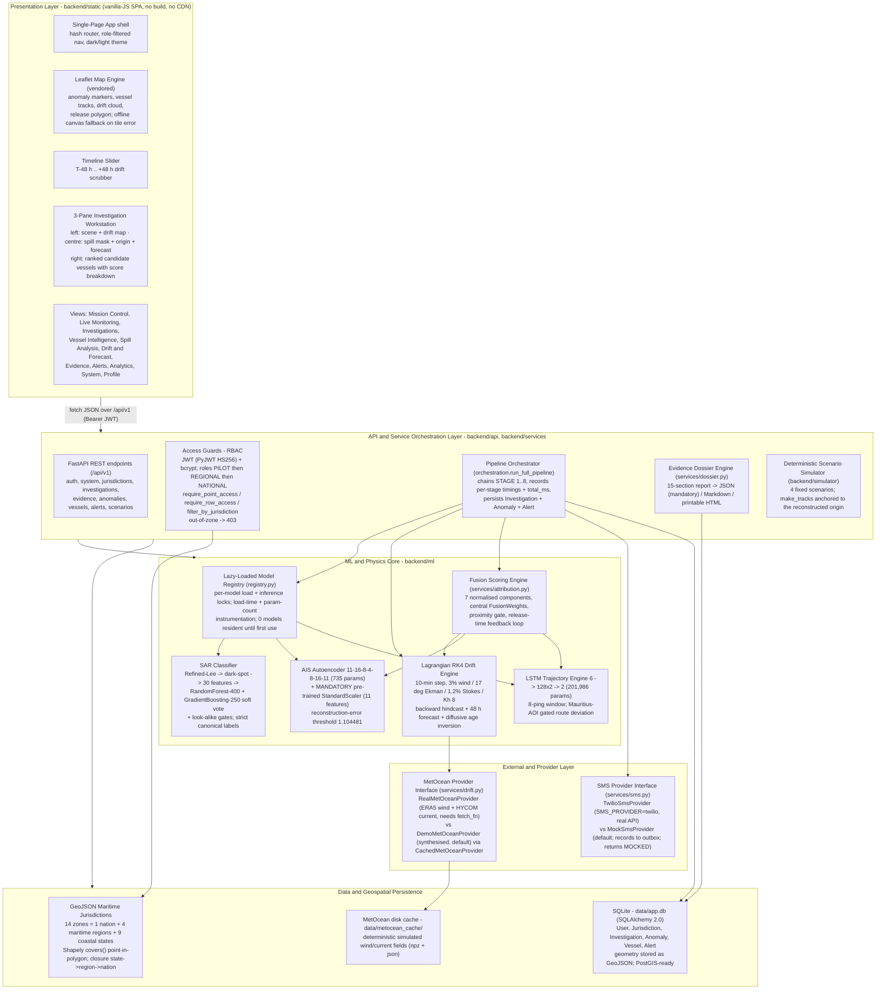

# OceanTrace — Technical Specification

**Project:** OceanTrace — a single FastAPI application for satellite oil‑spill
detection and AIS vessel attribution (SIH26143 / NTRO).
**Source basis:** merges the classical SAR + drift‑physics + RBAC spine of one
prototype with the pre‑trained AIS autoencoder + LSTM of another (see
`docs/MERGE_ARCHITECTURE.md`).
**Runtime:** offline‑first, CPU‑only, no GPU. Python 3.13, FastAPI, SQLite.
**Document date:** 2026‑09‑07 · all figures read directly from code constants and
committed model artifacts.

> Naming note: this specification uses the product name **OceanTrace** throughout.
> The source tree still carries its internal build name in `backend/core/config.py`
> (`APP_NAME`) and in historical *“ported from …”* provenance citations inside the
> ML docstrings; those citations record where code originated and are left intact.

---

## 1. ML & Physics Models — Statistics & Specifications

### 1.1 SAR Detection Ensemble — Random Forest + Gradient Boosting

Files: `backend/ml/sar/{config,preprocess,darkspot,features,classifier,characterize,pipeline}.py`,
`backend/ml/sar/labels.py`. Model artifact: `backend/ml/sar/models/oil_classifier.joblib`.

| Property | Value / Specification |
|---|---|
| **Detector type** | Classical chain → 30 hand‑engineered features → soft‑voting ensemble. No CNN / U‑Net (audit showed U‑Net *lowers* mask IoU 0.751→0.700 and adds ~2 s on CPU). |
| **Ensemble** | `VotingClassifier([RF, GB], voting="soft", weights=[1.0, 1.0])` on `StandardScaler`‑transformed features |
| &nbsp;&nbsp;Random Forest | `n_estimators=400`, `max_depth=None`, `min_samples_leaf=2`, `class_weight="balanced_subsample"`, `random_state=42` |
| &nbsp;&nbsp;Gradient Boosting | `n_estimators=250`, `learning_rate=0.06`, `max_depth=3`, `subsample=0.85`, `random_state=42` |
| **Input features (30)** | 13 geometry + 11 backscatter + 4 texture + 2 context, fixed order (`FEATURE_NAMES`) |
| &nbsp;&nbsp;Geometry (13) | `area_km2, perimeter_km, complexity, form_factor, elongation, eccentricity, solidity, extent, spreading, asymmetry, length_km, width_km, n_holes` |
| &nbsp;&nbsp;Backscatter (11) | `mean_contrast_db, max_contrast_db, std_inside_db, p10_contrast_db, p90_contrast_db, border_gradient_db_px, border_gradient_std, power_to_mean_ratio, contrast_ratio_linear, bg_std_db, inside_bg_std_ratio` |
| &nbsp;&nbsp;Texture / GLCM (4) | `glcm_contrast, glcm_homogeneity, glcm_energy, glcm_correlation` (32 grey levels) |
| &nbsp;&nbsp;Context (2) | `dist_to_land_km, local_wind_ms` |
| **Top‑5 RF importances** | `mean_contrast_db` 0.162 · `contrast_ratio_linear` 0.137 · `power_to_mean_ratio` 0.100 · `border_gradient_std` 0.096 · `p90_contrast_db` 0.084 |
| **Held‑out metrics** (simulated split, `oil_classifier_metrics.json`) | accuracy **0.9826**, precision **0.9375**, recall **0.8824**, F1 **0.9091**, ROC‑AUC **0.97**, average precision **0.928**; train/test = 516 / 172; confusion matrix `tn 154, fp 1, fn 2, tp 15` |
| **Refined‑Lee speckle filter** | `LEE_WINDOW = 7` (7×7 kernel, forced odd) · `LEE_DAMPING = 1.0` · nominal `EQUIV_NUM_LOOKS L = 4.4` (S1 IW GRDH ENL), auto‑estimated per scene from the most homogeneous 64×64 patch, clipped to `[0.5, 100]` |
| &nbsp;&nbsp;Regime split | `Cu = 1/√L`; `Cmax = 1.73·Cu`. `Ci ≤ Cu` → homogeneous → local mean · `Cu < Ci < Cmax` → textured → `mean + W·(pixel − mean)`, `W = clip(1 − Cu²/Ci², 0, 1)` · `Ci ≥ Cmax` → point target → pixel preserved (keeps ships) |
| &nbsp;&nbsp;Implementation | operates on **linear intensity** via separable OpenCV `boxFilter` passes (no per‑pixel Python); dB↔linear via `10·log10` / `10^(dB/10)` |
| **Dark‑spot segmentation** | `ADAPTIVE_BLOCK = 151` px local‑mean window · `ADAPTIVE_OFFSET_DB = 2.2` (dark if `pix < local_mean − 2.2 dB`) · `MIN_SPILL_AREA_PX = 350` · `MIN_SPILL_AREA_KM2 = 0.5` (larger of the two wins) · `MAX_SPILL_AREA_FRAC = 0.35` (a “spill” over 35 % of scene = artefact) · `MORPH_KERNEL = 5` · watershed split |
| **Sentinel‑1 nominal props** | pixel 10.0 m · incidence 33.0° · `LAND_BACKSCATTER_DB = −6.0` (radiometric land mask: median + 2.5·MAD bright‑tail) |
| **Classifier decision thresholds** | `OIL_PROBABILITY_THRESHOLD = 0.30` (simulated radiometry, recall side of the knee) · `REAL_DECISION_THRESHOLD = 0.75` (recalibrated for real Sentinel‑1) · confidence bands `HIGH ≥ 0.70`, `MEDIUM ≥ 0.45`, `LOW ≥ 0.30`, else `REJECTED` |
| **Look‑alike context gates (STEP 4)** — any one forces `Likely look-alike` regardless of classifier probability | wind `> 13.0 m/s` (`LOOKALIKE_MAX_WIND_MS`) · distance to land `< 0.6 km` (`LOOKALIKE_MIN_COAST_KM`, surf zone) · `border_gradient_db_px < 0.06` **and** `spreading > 82.0` (diffuse, round low‑wind cell) · `mean_contrast_db < 1.8` (`LOOKALIKE_MIN_CONTRAST_DB`) |
| **Canonical label constraint** | output MUST be exactly one of `CANONICAL_LABELS = ("Oil-like anomaly", "Likely look-alike", "No significant anomaly")`. `assert_canonical()` raises `ValueError` on anything else and is invoked as an invariant guard in the service wrapper. A detection is **never** asserted as “oil”, only as an *oil‑like anomaly*. Scene label = strongest of the per‑detection labels, rank `Oil-like anomaly (2) > Likely look-alike (1) > No significant anomaly (0)`. |
| **Fallback** | if no model file: deterministic `rule_based_score()` (physics rule, weighted contrast / border‑gradient / elongation / complexity / solidity terms) — pipeline still returns a defensible answer on a fresh checkout |
| **Memory footprint** | `oil_classifier.joblib` = **1,114,242 B ≈ 1.06 MiB** on disk (RF‑400 + GB‑250 trees over 30 features + a 30‑feature `StandardScaler`). Resident cost is single‑digit MB of Python/sklearn objects; the registry reports **no** `parameters` count for the sklearn estimator. |
| **CPU latency** | **Cold start** (first SAR scene of a process — includes `joblib.load` of the ensemble): **≈ 2.3–3.1 s** (of which `joblib.load` ≈ 2.5 s, one time). **Warm** (model resident): ingest ≈ 20 ms · Refined‑Lee preprocess ≈ 85–100 ms · segmentation + 30‑feature extraction + ensemble `predict_proba` ≈ 250–460 ms · characterisation ≈ 25–120 ms → **≈ 0.45–0.7 s** end‑to‑end for the SAR stage. Loaded lazily via `registry["sar_classifier"]`. |

---

### 1.2 AIS Anomaly Autoencoder (POSEatSea)

Files: `backend/ml/ais/{config,anomaly}.py`. Artifacts:
`backend/ml/ais/models/ais_phase1_autoencoder.pth`,
`backend/ml/ais/models/ais_phase1_scaler.joblib`.

| Property | Value / Specification |
|---|---|
| **Architecture** | Undercomplete feed‑forward autoencoder, `strict=True` state‑dict load |
| &nbsp;&nbsp;Encoder | `Linear(11→16)` · ReLU · `Linear(16→8)` · ReLU · `Linear(8→4)` |
| &nbsp;&nbsp;Decoder | `Linear(4→8)` · ReLU · `Linear(8→16)` · ReLU · `Linear(16→11)` |
| &nbsp;&nbsp;Dims | `AE_INPUT_DIM = 11`, `AE_LATENT_DIM = 4` |
| **Parameter count** | **735** = encoder 364 `((11·16+16)+(16·8+8)+(8·4+4) = 192+136+36)` + decoder 371 `((4·8+8)+(8·16+16)+(16·11+11) = 40+144+187)` |
| **Model file size** | `ais_phase1_autoencoder.pth` = **8,141 B ≈ 8 KB** |
| **Feature vector (11, positional order fixed by the checkpoint)** | `speed, course, rot, msg_type, status, accuracy, course_diff, rot_diff, speed_diff, lat_diff, long_diff` — the 5 `*_diff` features are per‑MMSI first differences (sorted by timestamp); `course_diff` is circular‑wrapped to `[-180°, +180°]`. Missing feed fields default to Class‑A `msg_type = 1`, `accuracy = 1`. |
| **StandardScaler (mandatory)** | `ais_phase1_scaler.joblib` = **863 B**, pickled under scikit‑learn 1.6.1, `n_features_in_ = 11`. `_validate_scaler()` refuses `None` or any object missing `mean_` / `scale_` / `transform`, or whose `n_features_in_ ≠ 11`. `_reconstruction_errors()` is the **single** code path to the network and always calls `scaler.transform` first — there is no unscaled path. A regression test proves bypassing the scaler changes the answer by ~100×. |
| **Reconstruction error** | per ping: `mse = mean_{i=1..11} (x_scaled − decoder(encoder(x_scaled)))²`; vessel score = **peak** ping `mse` in the spatiotemporal window near the slick |
| **Anomaly threshold** | `AE_THRESHOLD = 1.104481` (reconstruction‑error cut fixed at training time). `is_anomaly ⇔ mse ≥ 1.104481`. |
| **Severity bands** | `ratio = score / AE_THRESHOLD` → `ratio ≥ 5.0` **critical** (`SEVERITY_CRITICAL_RATIO`) · `ratio ≥ 2.0` **high** (`SEVERITY_HIGH_RATIO`) · `ratio > 1.0` **elevated** · else **normal** |
| **Log‑mapping to fusion score [0, 1]** | `anomaly_score_0_1(peak_err) = clip( ln(1 + peak_err / τ) / ln(1 + R_sat), 0, 1 )` with `τ = AE_THRESHOLD = 1.104481` and `R_sat = 6.0` ⇒ denominator `ln(7) ≈ 1.945910`. Returns 0 for `peak_err ≤ 0`; saturates at 1 when `peak_err / τ ≈ 6` (`peak_err ≈ 6.63`). |
| **Held‑out metrics** | F1 **0.567**, precision **0.930**, recall **0.408** — precision‑heavy: a flag is strong evidence; absence of a flag is *no* evidence. |
| **Near‑slick gate** | a flag counts only if the ping is within `AIS_ANOMALY_NEAR_RADIUS_KM = 25.0 km` of the reconstructed origin **and** inside `release_window ± TIME_PAD_H (2.0 h)` |
| **CPU latency** | **Cold** (first fusion of a process — lazy `import torch` + build net + `torch.load` + `joblib.load` scaler): **≈ 4–6 s** (dominated by the torch import, one time per process). **Warm**: forward pass over tens–hundreds of pings is **sub‑millisecond to a few ms**; the enclosing `ais_correlation` stage (track normalisation + AE scoring + traffic gate) measures **≈ 0.6–2.0 s** warm and is dominated by pandas/NumPy track work, not the AE. Loaded lazily via `registry["ais_anomaly"]`. |

---

### 1.3 Trajectory LSTM (POSEatSea)

Files: `backend/ml/trajectory/{config,lstm}.py`. Artifact:
`backend/ml/trajectory/models/trajectory_lstm_baseline.pth`.

| Property | Value / Specification |
|---|---|
| **Architecture** | `nn.LSTM(input=6, hidden=128, num_layers=2, batch_first=True, dropout=0.1)` → `nn.Linear(128 → 2)` head on the last timestep; `strict=True` load |
| **Input sequence length** | `SEQ_LEN = 8` — the model consumes **exactly** 8 AIS pings (any other count → `usable = False`) |
| **Input dim** | `TRAJ_INPUT_DIM = 6` = `[lat_norm, lon_norm, speed_norm, sin(course), cos(course), rot_norm]`, derived from 5 history columns `[latitude, longitude, speed, course, rot]` |
| **Hidden / layers** | `TRAJ_HIDDEN_DIM = 128`, `TRAJ_NUM_LAYERS = 2` (≈ `128×2`) |
| **Output** | next‑position `(lat_norm, lon_norm)`, de‑normalised through the AOI box |
| **Parameter count** | **201,986** = LSTM layer‑0 `4·128·(6+128) + 2·(4·128) = 68 608 + 1 024 = 69 632` + LSTM layer‑1 `4·128·(128+128) + 2·(4·128) = 131 072 + 1 024 = 132 096` + head `128·2 + 2 = 258` |
| **Model file size** | `trajectory_lstm_baseline.pth` = **811,002 B ≈ 811 KB** (≈ 792 KiB) |
| **Mauritius AOI box** (normalisation anchor + hard geographic gate) | `LAT_MIN = −20.565386666666665`, `LAT_MAX = −20.05773333333333`, `LON_MIN = 57.725333333333325`, `LON_MAX = 58.37872`. Any of the 8 pings outside → `blockers` set, `usable = False`; the route‑deviation fusion component then contributes **0** (an out‑of‑region vessel is never penalised for a meaningless guess). |
| **Normalisation** | lat/lon → `(x − min)/(max − min)`; `speed_norm = clip(speed, 0, SPEED_MAX)/SPEED_MAX`, `SPEED_MAX = 19.3 kn` (99.9th pct of training speed, also the input clip ceiling); course → `sin`, `cos`; `rot_norm = clip(rot, −128, 128)/128` |
| **Kinematic gates** (`assess_inputs`) | median ping gap `> 2.5 × TRAJ_NOMINAL_INTERVAL_S (60 s) = 150 s` → confidence **degraded** · recent mean heading (last 3 pings) outside reliable course bands `TRAJ_RELIABLE_COURSE_BANDS = ((200°, 290°), (20°, 110°))` → **degraded** · mean speed `< 0.5 kn` (stationary) → **degraded** · max speed `> 19.3 kn` → clipped‑warning · `COVERAGE_GAP_FACTOR = 4.0` (a truth ping later than 4× the window cadence is a reception gap, excluded from the deviation trace) |
| **Route‑deviation score [0, 1]** | needs `≥ SEQ_LEN + 1 = 9` pings; walk an 8‑ping window, predicted vs actual next position; `score = clip( max_deviation_km / DEVIATION_SCORE_SCALE_KM, 0, 1 )`, `DEVIATION_SCORE_SCALE_KM = 5.0 × TRAJ_P90_ERROR_KM = 5.0 × 0.63 = 3.15 km` |
| **Held‑out accuracy** | mean next‑position error **0.37 km**, median **0.19 km**, p90 **0.63 km** (valid only inside the Mauritius AOI) |
| **CPU latency** | **Cold**: `torch.load` ≈ **0.02 s** (torch already imported by the AE) — negligible. **Warm**: each rolling 8‑ping forward pass is sub‑millisecond; whole‑track `route_deviation_score` folds into the fusion stage. Loaded lazily via `registry["trajectory"]`. |

---

### 1.4 Lagrangian RK4 Surface‑Drift Physics Engine

Files: `backend/ml/drift/{config,particles,aging,hindcast,forecast,metocean,geo}.py`,
service wrapper `backend/services/drift.py`.

| Property | Value / Specification |
|---|---|
| **Advection model** | `u_total = a_c·U_current + a_w·R(θ)·U_wind10 + a_s·U_wind10 + turbulent random walk` |
| &nbsp;&nbsp;Current factor `a_c` | `CURRENT_FACTOR = 1.00` (full advection by the surface current) |
| &nbsp;&nbsp;Wind‑drift factor `a_w` | `WIND_DRIFT_FACTOR = 0.030` — the classic **3.0 %** rule (ASCE 1996; Reed 1999) |
| &nbsp;&nbsp;Ekman / Coriolis deflection `R(θ)` | `WIND_DEFLECTION_DEG = 17.0°` — rotates the wind vector 17° to the **right** in the N hemisphere, **left** in the S hemisphere (`hemi = sign(mean latitude)`) |
| &nbsp;&nbsp;Stokes drift `a_s` | `STOKES_FACTOR = 0.012` — **1.2 %** of wind (developed wind sea, deep water), downwind |
| &nbsp;&nbsp;Turbulent random walk | `σ_step = √(2·K_h·|dt|)` (Fickian equivalence), `K_h = HORIZONTAL_DIFFUSIVITY = 8.0 m²/s` (coastal/shelf eddy diffusivity) |
| **Integrator** | classic 4th‑order Runge–Kutta in a local East–North metric frame (`rk4_step`, 4 field evaluations per step). Autonomous‑in‑time ODE ⇒ a **negative** timestep runs the same code path **backwards** → the hindcast and forecast are guaranteed consistent. |
| **Time step** | `TIMESTEP_S = 600` = **10 minutes** (`n_steps = ⌈|Δt| / 600⌉`, ≥ 1) |
| **Hindcast horizon** | `MAX_BACKTRACK_H = 48 h` |
| **Forecast horizon** | `MAX_FORECAST_H = 48 h`; reported at `FORECAST_HORIZONS_H = (6, 12, 24, 48) h` with first‑contact ETA and % ashore |
| **Particle count** | `DRIFT.N_PARTICLES = 900` (library default). **Production (orchestrator):** standalone STEP‑4 hindcast + forecast run **400** particles; the iterative release‑time feedback loop runs **280** particles (`backend/services/orchestration.py`). |
| **Coastline constraint** | on reaching shore a parcel **strands** — stops advecting, holds its last in‑water position (running backwards, oil cannot have originated on land). `BEACH_MOVE_EPS_DEG = 1e‑7` “has stopped moving” threshold. |
| **Origin reconstruction** | origin‑probability raster `ORIGIN_GRID = 140 × 140`, pad `ORIGIN_GRID_PAD_KM = 8.0 km`, Gaussian smooth `ORIGIN_GRID_SMOOTH = 2.2`; outputs best estimate, uncertainty radius, confidence ellipse, release polygon |
| **Diffusive age inversion → release‑time window** | a passive filament spreads as `σ² = σ₀² + 2·K_h·t`. Inverting the observed cross‑drift width: `t_s = max(σ² − σ₀², 0) / (2·K_h)`, `age_h = t_s / 3600`. `σ = width_m / AGE_SPAN_FACTOR`, `σ₀ = AGE_INITIAL_WIDTH_M / AGE_SPAN_FACTOR`. Parameters: `AGE_INITIAL_WIDTH_M = 450.0` (effective initial filament width — wake turbulence + gravity spreading), `AGE_SPAN_FACTOR = 3.29` (5th–95th‑pct span of a Gaussian = 3.29·σ), `AGE_K_UNCERTAINTY = 2.2` (K_h uncertain ~×2, `age ∝ 1/K_h` ⇒ window `[age/2.2, age·2.2]`), `RELEASE_WINDOW_NEAR_H = 0.5` (near edge of the search window stays open). |
| **Centroid‑only seeding** | isotropic Gaussian cloud, `DEFAULT_SEED_SIGMA_M = 1000.0` |
| **Met‑ocean demo field** (`METOCEAN`) | mean wind **7.5 m/s** FROM **225°**; mean current **0.35 m/s** TO **60°**; grid `26 × 26 × 41` (nx·ny·nt), pad `90 km`, seed `20261`, time window `[−54 h, +54 h]` |
| **Execution speed** | 400‑particle backward hindcast + 48 h forecast (up to ~288 RK4 steps each, 4 field evals/step): **≈ 1.2–1.4 s** warm on one CPU core. The feedback loop re‑runs the hindcast (280 particles) once per iteration (≤ 2). Look‑alike scenes skip drift entirely (0 ms). |

---

### 1.5 Unified Attribution Fusion Engine

Files: `backend/ml/attribution/{config,spatiotemporal,axis,proximity,score,geo}.py`,
service `backend/services/attribution.py`.

Each component is normalised to `[0, 1]` by its primitive **before** weighting.
The engine renormalises the configured weights over whatever components are
*available* for a given vessel (`eff_w[k] = base_w[k] / Σ_{available} base_w`).

| Evidence family | Component | Configured weight (`FusionWeights`) | What it measures |
|---|---|---:|---|
| **Physical** | `spatiotemporal` | **0.26** | hindcast‑origin ↔ vessel space‑time coincidence in the release window (volume search over the backward‑drift particle cloud) |
| **Physical** | `axis_alignment` | **0.16** | vessel course through the window vs the slick’s reverse‑drift axis; `score = clip(1 − Δ/AXIS_TOLERANCE_DEG, 0, 1)`, `AXIS_TOLERANCE_DEG = 55.0°`, undirected (folded to `[0°, 90°]`) |
| **AIS** | `proximity` (CPA) | **0.12** | true closest point of approach of the track polyline to the reconstructed origin; `cpa_score = clip(1 − (cpa_km / radius)^0.5, 0, 1)`, 0 beyond `SEARCH_RADIUS_KM = 25 km` |
| **AIS** | `blackout` | **0.12** | longest AIS dark period over the release window; `score = clip(minutes / BLACKOUT_FULL_SCORE_MIN, 0, 1)`, `BLACKOUT_FULL_SCORE_MIN = 120.0` (a 2 h+ gap scores 1.0) |
| **AIS** | `ais_anomaly` | **0.14** | POSEatSea autoencoder peak reconstruction error on pings near the slick (§1.2 log‑map); available only if the AE is engaged and pings fall inside 25 km × (window ± 2 h) |
| **Behavioural** | `route_deviation` | **0.12** | POSEatSea LSTM peak actual‑vs‑predicted track departure (§1.3); available only when `usable = True` (inside the Mauritius AOI) |
| **Behavioural** | `vessel_prior` | **0.08** | a‑priori discharge likelihood by vessel‑type group |
| | **Σ** | **1.00** | |

> The configured `FusionWeights` in code are `0.26 / 0.16 / 0.12 / 0.12 / 0.14 /
> 0.12 / 0.08` (physical `spatiotemporal, axis_alignment`; AIS `proximity,
> blackout, ais_anomaly`; behavioural `route_deviation, vessel_prior`), summing
> to 1.00. (A weight profile of `0.30 / 0.18 / 0.14 / 0.10 / 0.10 / 0.09 / 0.09`
> also sums to 1.00 and can be supplied at call time via the `weights` argument
> or a `dict` override — `fuse_attribution` renormalises any override — but it is
> **not** the value currently baked into `FusionWeights`.)

**Baseline (physical‑only) weights** — `AttributionWeights`, used by the Phase‑5
`rank_candidates` path: `spatiotemporal 0.45`, `axis_alignment 0.30`,
`proximity 0.15`, `dwell 0.10` (POSEatSea `dwell` term = share of the vessel’s
*own* observed time spent inside the search radius).

| Gate / kernel / band | Value |
|---|---|
| **Spatial gate** | `SEARCH_RADIUS_KM = 25.0 km` around the reconstructed origin |
| **Temporal pad** | `TIME_PAD_H = 2.0 h` on each side of the release window |
| **Spatiotemporal kernel** | `ST_KERNEL_SIGMA_KM = 7.0` (Gaussian half‑width for space‑time overlap) · `ST_PROXIMITY_SIGMA_KM = 5.0` (direct proximity to the nearest origin parcel) · `ST_CONSISTENCY_HALF_WIN_H = 1.5 h` |
| &nbsp;&nbsp;Volume‑search score | `score = clip( (0.42·prox + 0.36·rel_overlap + 0.22·rel_consist) · prior, 0, 1)`; `prior = 0.80` if the best match time falls outside the age‑prior window ± 8 h, else 1.0 |
| **Proximity gate** | `PROXIMITY_GATE_ENABLED = True`, `PROXIMITY_GATE_KNEE = 0.12`. `signal = max(spatiotemporal, proximity)`; `gate = clip(signal / 0.12, 0, 1)`; **`total = clip( (Σ eff_w·value)·100 · gate, 0, 100)`** — a vessel with no space‑time signal is scaled toward 0. |
| **Blackout full score** | `BLACKOUT_FULL_SCORE_MIN = 120.0 min` |
| **AE near‑radius** | `AIS_ANOMALY_NEAR_RADIUS_KM = 25.0 km` (= `SEARCH_RADIUS_KM`) |
| **Vessel‑type priors** (`TYPE_PRIOR`) | `TANKER 1.00 · CARGO 0.72 · BULK 0.70 · CONTAINER 0.62 · TUG 0.40 · PASSENGER 0.35 · FISHING 0.30 · OTHER / UNKNOWN 0.30 · HSC 0.25 · MILITARY 0.20 · PLEASURE 0.15`; default `VESSEL_PRIOR_DEFAULT = 0.30` |
| **Assessment bands** (0–100 score → label, `assessment_band()`) | `PRIME_SUSPECT ≥ 70.0` · `PERSON_OF_INTEREST ≥ 45.0` · `WEAK_LEAD ≥ 20.0` · `BACKGROUND_TRAFFIC` in `[8.0, 20.0)` · `CLEARED` `< MIN_SCORE_TO_REPORT = 8.0` |
| **Reporting floor** | `MIN_SCORE_TO_REPORT = 8.0`; `MIN_TRACK_POINTS = 2` |

**Release‑time feedback loop** (`attribute_with_feedback`)

| Parameter | Default | Orchestrator value |
|---|---:|---:|
| `max_iterations` | 3 | **2** |
| `n_particles` (per‑iteration hindcast) | library default | **280** |
| `min_top_score` (below → top candidate not fed back, loop stops) | **45.0** | 45.0 |
| `feedback_half_window_h` (new release window = `age ± this`) | **2.5 h** | 2.5 h |
| `converge_km` (origin shift below → converged) | **1.5 km** | 1.5 km |
| `converge_h` (Δ age estimate below → converged) | **0.75 h** | 0.75 h |
| `radius_km` | `None` → `SEARCH_RADIUS_KM` (25 km) | 25 km |

**Loop mechanics:** iterate — run hindcast → `fuse_attribution` → take the top
candidate’s `best_match_time_h` → re‑run the hindcast with the release window
re‑centred on `|best_match_time_h| ± 2.5 h` → re‑rank. **Stop** when *(a)* the top
score `< 45.0`, or *(b)* there is no AIS space‑time match time, or *(c)*
`|Δage| < 0.75 h` **and** `origin_shift_km < 1.5 km` (**converged**), or *(d)*
`max_iterations` reached. The loop typically moves the origin error from ~30 km
(physics‑only) to ~3 km (AIS‑constrained).

**Alert trigger:** an SMS is dispatched only when
`sar.confidence ≥ ALERT_CONFIDENCE_THRESHOLD (0.75)` **and** a prime suspect
exists. Fingerprint = location grid `ALERT_DEDUP_GRID_DEG = 0.05°` (~5.5 km) +
time bucket `ALERT_DEDUP_TIME_BUCKET_MINUTES = 60` + geometry signature;
duplicates suppressed within `ALERT_DEDUP_COOLDOWN_MINUTES = 180`;
`ALERT_MAX_SEND_ATTEMPTS = 3`.

---

## 2. End‑to‑End Pipeline Execution Flow

```mermaid
graph TD
    A["Satellite scene in (GeoTIFF / PNG quicklook)"] --> B["STAGE 1 - Ingestion<br/>sigma0 dB, bbox, acquisition time<br/>optional decimation to max_dim"]
    B --> C["STAGE 2 - Preprocessing<br/>Refined-Lee speckle filter 7x7 (ENL 4.4)<br/>dB calibration, radiometric land/sea mask, coastal buffer"]
    C --> D["STAGE 3 - Segmentation<br/>adaptive dark-spot (block 151, offset 2.2 dB)<br/>watershed split, area floor 350 px / 0.5 km2"]
    D --> E["STAGE 3 - Classification<br/>30 features -> RF-400 + GB-250 soft vote (thr 0.30)<br/>look-alike context gates (wind, coast, edge, contrast)"]
    E --> F{"Scene label?"}

    F -->|"Likely look-alike / No significant anomaly"| G["EARLY EXIT<br/>resolve jurisdiction (point-in-polygon)<br/>status = RESOLVED, no alert"]
    G --> V["STAGE 8 - Dossier generation<br/>JSON (system of record) + Markdown + printable HTML"]

    F -->|"Oil-like anomaly (confidence)"| H["Observed slick<br/>polygon + centroid + characterisation<br/>(area, axes, orientation, cross-drift width)"]

    H --> I["STAGE 4 - RK4 Hindcast (backward)<br/>Lagrangian cloud 400 particles, 10-min step, up to 48 h<br/>3% wind + 17 deg Ekman + 1.2% Stokes + Kh 8 m2/s random walk<br/>-> origin-probability raster (140x140), release polygon, ellipse"]
    I --> J["STAGE 4 - Release-window estimation<br/>diffusive age inversion: sigma^2 = sigma0^2 + 2*Kh*t<br/>age window = age/2.2 .. age*2.2, near edge 0.5 h"]
    J --> K["STAGE 4 - Forward Forecast<br/>same RK4 code path, +6 / +12 / +24 / +48 h<br/>first-contact ETA + percent ashore"]

    I --> L["STAGE 5 - AIS traffic gating<br/>normalise pings, drop impossible speeds, segment on gaps<br/>spatial gate 25 km around origin, temporal gate window +/- 2 h"]
    J --> L

    L --> M["STAGE 6 - Per-vessel AIS scoring<br/>AE anomaly: peak reconstruction error near slick<br/>(StandardScaler mandatory) -> log-map to 0..1, thr 1.104481"]
    L --> N["STAGE 6 - Per-vessel LSTM route deviation<br/>8-ping windows, actual vs predicted next position<br/>AOI-gated (Mauritius box) -> score 0 if not usable"]
    L --> O["STAGE 6 - Physical + AIS criteria<br/>spatiotemporal volume search, slick-axis alignment (tol 55 deg)<br/>true CPA, AIS blackout, vessel-type prior"]

    M --> P["STAGE 6 - Unified Fusion Engine<br/>weights: ST 0.26, axis 0.16, CPA 0.12, blackout 0.12,<br/>AE 0.14, route-dev 0.12, prior 0.08 (renormalised over available)<br/>proximity gate: total = sum(w*v)*100 * clip(max(ST,CPA)/0.12, 0, 1)"]
    N --> P
    O --> P

    P --> Q["Ranked candidates + assessment band<br/>PRIME_SUSPECT at least 70 / PERSON_OF_INTEREST at least 45 /<br/>WEAK_LEAD at least 20 / BACKGROUND_TRAFFIC / CLEARED"]

    Q --> R{"STAGE 7 - Release-time feedback loop<br/>top score at least 45 and has best_match_time?"}
    R -->|"yes; not converged; iter under 2"| S["Re-centre release window on abs(best_match_time) +/- 2.5 h<br/>re-run RK4 hindcast (280 particles) -> re-rank"]
    S --> R
    R -->|"converged: origin shift under 1.5 km and age delta under 0.75 h<br/>or top score under 45 or iter = 2"| T["Final ranking + refined origin / release window"]

    T --> U["STAGE 7 - Jurisdiction mapping<br/>Shapely point-in-polygon over 14 GeoJSON maritime zones<br/>chain: coastal state -> maritime region -> nation"]
    U --> W{"STAGE 8 - Alert gate<br/>confidence at least 0.75 AND prime suspect exists?"}
    W -->|"yes"| X["Fingerprint (0.05 deg grid + 60-min bucket + geometry sig)<br/>dedup within 180-min cooldown<br/>SMS dispatch: Twilio provider or Mock provider (default)<br/>status SENT / MOCKED / FAILED / SUPPRESSED, up to 3 attempts"]
    W -->|"no"| Y["No alert raised (reason recorded)"]
    X --> V
    Y --> V
    T --> V

    V --> Z["Investigation persisted<br/>summary_metrics: sar, hindcast, forecast, attribution,<br/>feedback_loop, jurisdiction, per-stage timings + total_ms"]
```

---

## 3. System Architecture

---

### Appendix — key file map

| Area | Path |
|---|---|
| SAR detection | `backend/ml/sar/` · service `backend/services/satellite.py` |
| Drift physics | `backend/ml/drift/` · service `backend/services/drift.py` |
| Baseline + fusion attribution | `backend/ml/attribution/` · service `backend/services/attribution.py` |
| AIS autoencoder / LSTM | `backend/ml/ais/` · `backend/ml/trajectory/` |
| Lazy model registry | `backend/ml/registry.py` |
| Pipeline orchestrator | `backend/services/orchestration.py` |
| Evidence dossier | `backend/services/dossier.py` |
| Jurisdiction + RBAC | `backend/services/jurisdiction.py` · `backend/api/_authz.py` |
| SMS alerting | `backend/services/sms.py` |
| Deterministic scenarios | `backend/simulator/scenarios.py` |
| Operations Console | `backend/static/` (`index.html`, `css/app.css`, `js/{api,map,views,app}.js`) |
